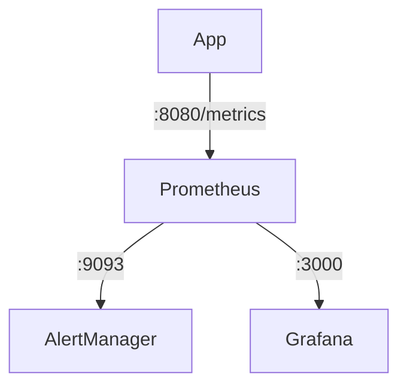

# Alertmanager-demo

The Alertmanager handles alerts sent by client applications such as the Prometheus server. It takes care of deduplicating, grouping, and routing them to the correct receiver integration such as email, PagerDuty, or OpsGenie. It also takes care of silencing and inhibition of alerts.

## Flow



### Starting

```
docker-compose up
```

### Stack

| Service              | URL                                                |
|----------------------|----------------------------------------------------|
| app - openapi        | [8080](http://localhost:8080/swagger-ui.html)      |
| app - metrics        | [8080](http://localhost:8080/actuator/prometheus) |
| prometheus           | [9090](http://localhost:9090)                      |
| alertmanager         | [9093](http://localhost:9093)                      |
| grafana - ui         | [3000](http://localhost:3000)                      |
| grafana - datasource | [3000](http://localhost:3000/api/datasources)      |

### Prometheus

Reset database

```
curl -XPOST -g 'http://localhost:9090/api/v1/admin/tsdb/delete_series?match[]={}'
```

Restarting application

```
docker-compose restart app
```

### Grafana

User/Pass: admin/admin


### Simulate fail

```
STATUS_CODE=400
curl -XGET "http://localhost:8080/status/$STATUS_CODE"  -v
```

or

```
for i in {1..500}; do   echo "Command no. $i"; sh -c  "curl -XGET http://localhost:8080/status/400" ; sleep .5 ; done
```


### App locally

```
./gradlew bootRun
```

### Ref

* [Prometheus - Rules](https://awesome-prometheus-alerts.grep.to/rules.html)
* [AlertManager - Slack](https://api.slack.com/messaging/webhooks)
* [AlertManager - Doc](https://prometheus.io/docs/alerting/latest/alertmanager/)